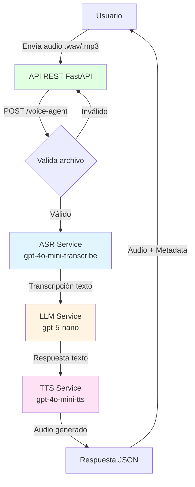

# Arquitectura del Sistema - Voice Agent AI

## Diagrama de Flujo del Sistema



## Componentes Principales

### 1. API REST (FastAPI)
- **Responsabilidad**: Punto de entrada HTTP para el microservicio
- **Endpoints**:
  - `POST /voice-agent` - Procesa audio y retorna respuesta
  - `GET /health` - Health check del servicio
  - `GET /docs` - Documentación Swagger automática
- **Input**: Archivo audio (multipart/form-data)
- **Output**: JSON con transcripción, respuesta y audio base64

### 2. ASR Service (Automatic Speech Recognition)
- **Modelo**: `gpt-4o-mini-transcribe`
- **Costo**: $0.003 / minuto
- **Función**: Convierte audio a texto
- **Input**: Archivo de audio (.wav, .mp3)
- **Output**: String con transcripción

### 3. LLM Service (Language Model)
- **Modelo**: `gpt-5-nano`
- **Costo**: $0.05 input / $0.40 output (por 1M tokens)
- **Función**: Procesa el texto y genera respuesta inteligente
- **Input**: Texto transcrito
- **Output**: Texto de respuesta

### 4. TTS Service (Text to Speech)
- **Modelo**: `gpt-4o-mini-tts`
- **Costo**: $0.015 / minuto
- **Función**: Convierte texto a voz
- **Input**: Texto de respuesta
- **Output**: Archivo de audio (.mp3)

## Flujo de Datos Detallado

```
1. Usuario envía petición HTTP POST con archivo de audio
   ↓
2. FastAPI valida el archivo (formato, tamaño)
   ↓
3. ASR Service transcribe audio → texto
   ↓
4. LLM Service procesa texto → genera respuesta
   ↓
5. TTS Service convierte respuesta → audio
   ↓
6. API retorna JSON:
   {
     "transcription": "texto original",
     "response_text": "respuesta generada",
     "audio_base64": "audio en base64",
     "processing_time": 1.23
   }
```

## Decisiones Técnicas

### Framework: FastAPI
- **Por qué**: Rendimiento alto, soporte async/await, OpenAPI automático
- **Beneficios**: Documentación automática, validación con Pydantic

### Modelos OpenAI (más económicos)
- **ASR**: gpt-4o-mini-transcribe - Balance costo/calidad
- **LLM**: gpt-5-nano - Modelo más barato para procesamiento básico
- **TTS**: gpt-4o-mini-tts - Generación de voz económica

### Arquitectura de Servicios
- **Separación de responsabilidades**: Cada servicio (ASR, LLM, TTS) independiente
- **Facilita testing**: Tests unitarios por servicio
- **Escalabilidad**: Servicios pueden distribuirse si es necesario

### Manejo de Audio
- **Formatos soportados**: WAV, MP3
- **Almacenamiento temporal**: Archivos se eliminan después del procesamiento
- **Encoding**: Base64 para transmisión en JSON

## Stack Tecnológico

| Componente | Tecnología |
|------------|------------|
| Framework Web | FastAPI 0.100+ |
| API IA | OpenAI API |
| Validación | Pydantic |
| Tests | Pytest |
| Containerización | Docker |
| CI/CD | GitHub Actions |
| Deploy | Render / Railway |

## Consideraciones de Seguridad

1. **API Key**: Almacenada en variables de entorno (`.env`)
2. **Validación de archivos**: Límite de tamaño, validación de formato
3. **Rate limiting**: Prevenir abuso del servicio (futuro)
4. **Limpieza de archivos**: Eliminación automática de temporales

## Métricas y Costos Estimados

**Por petición típica (audio de 1 minuto):**
- ASR: $0.003
- LLM: ~$0.0001 (500 tokens)
- TTS: $0.015
- **Total**: ~$0.018 por petición

## Escalabilidad Futura

1. **Cache**: Redis para respuestas frecuentes
2. **Queue**: RabbitMQ/Celery para procesamiento asíncrono
3. **Load Balancer**: Nginx para distribución de carga
4. **Monitoring**: Prometheus + Grafana para métricas
